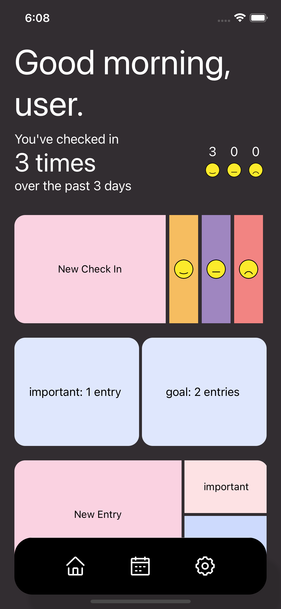

an easy journalling app. supports regular text entries, focuses on letting users "check in" with emojis.

todo:
[ ] home screen widgets
    - [ ] check in stats widget
[ ] animations
[ ] new entry / check in  button in toolbar
[ ] journal entries screen
    - [ ] sorting, searching
[ ] emoji tagging screen
    - [ ] let users define emotion valence + arousal for possible emojis

screenshots:
